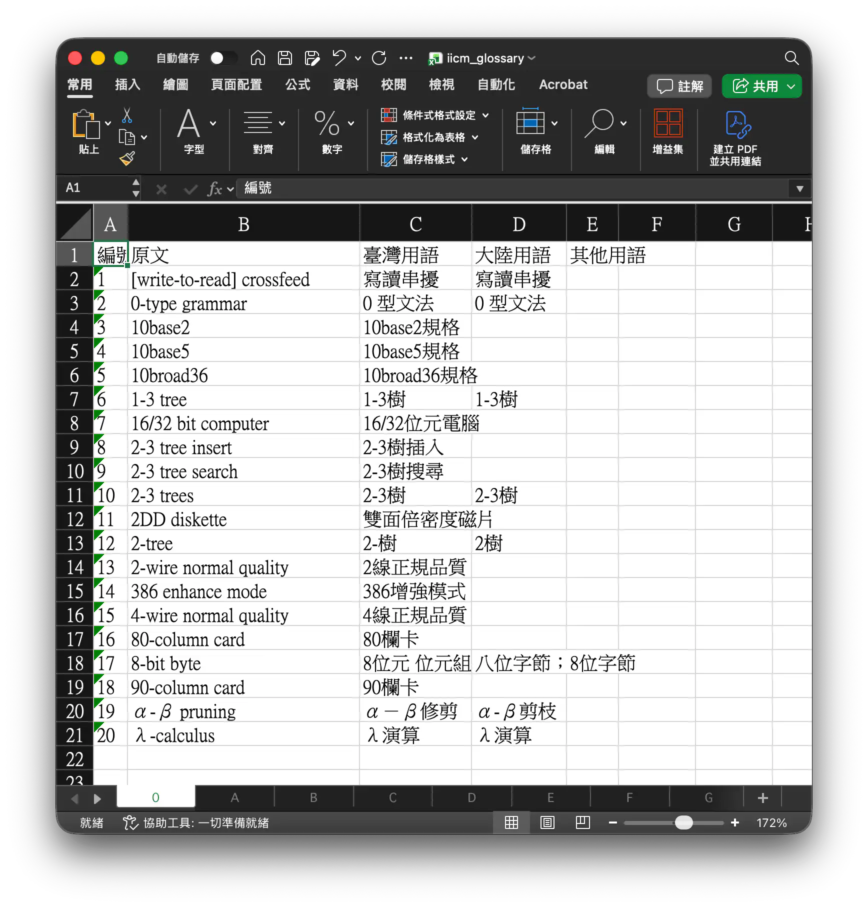

# 中華民國資訊學會詞彙表備份

因為 [中華民國資訊學會](http://www.iicm.org.tw) 的網站下線，為了讓譯者能夠方便參考詞彙表，避免給 [Wayback Machine](https://web.archive.org/web/20240707035538/http://www.iicm.org.tw/term/termb_B.htm) 上的備份帶來太大壓力，並提升程式讀取的體驗，故使用爬蟲爬取最新的資訊學會詞彙表。

> [!WARNING]
> 注意詞彙表的著作權由 **中華民國資訊學會** 所有，僅程式碼部分以 The Unlicense 授權。

## 程式碼結構

- `crawler.py`: 從 Wayback Machine 爬取中華民國資訊學會的詞彙表 HTML
- `html_to_csv.py`: 將中華民國資訊學會的詞彙表 HTML 轉換成 CSV
- `csv_to_excel.py`: 將中華民國資訊學會的 CSV 詞彙表轉換成 Excel 試算表
- `csv_to_sqlite.py`: 將中華民國資訊學會的 CSV 詞彙表轉換成 SQLite 資料庫

執行（需要先安裝 [uv](https://docs.astral.sh/uv/)）：

```bash
uv run python3 [script_name].py
```

## 產物結構

> [!TIP]
> 一般使用者請直接閱讀整理過的 [Google Sheet](https://link.pan93.com/iicm-glossary-gsheet)。

產物在 [artifacts](./artifacts) 目錄下。

- [iicm-glossary-html](./artifacts/iicm-glossary-html): Wayback Machine 上下載到的詞彙表 HTML 原始檔
- [iicm-glossary-csv](./artifacts/iicm-glossary-csv): 從 HTML 原始檔轉換而來的 CSV，已經進行資料清理
- [iicm_glossary.xlsx](./artifacts/iicm_glossary.xlsx): 從 CSV 轉換而來的 Excel 檔案，以工作表區分字母
- [iicm_glossary.db.gz](./artifacts/iicm_glossary.db.gz): 從 CSV 轉換而來的壓縮 SQLite 資料庫檔案，適合用於程式讀取
- [Google Sheet](https://link.pan93.com/iicm-glossary-gsheet): 將 Excel 檔案匯入進 Google 試算表，便於線上查詢

## SQLite 資料庫結構

Table: `glossary`

| 欄位名稱     | 欄位類型       | 欄位描述               | PK/FK |
| ------------ | -------------- | ---------------------- | ----- |
| `letter`     | `char(1)`      | 詞彙表上的原始字母分類 | PK    |
| `id`         | `integer`      | 詞彙表上的原始編號     | PK    |
| `term`       | `varchar(255)` | 原始詞彙 | |
| `term_tw`    | `varchar(255)` | 臺灣用語               |       |
| `term_cn`    | `varchar(255)` | 大陸用語               |       |
| `term_other` | `varchar(255)` | 其他用語               |       |

## Excel 檔案結構


